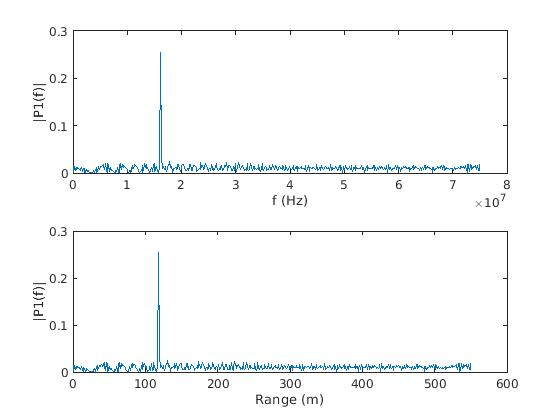
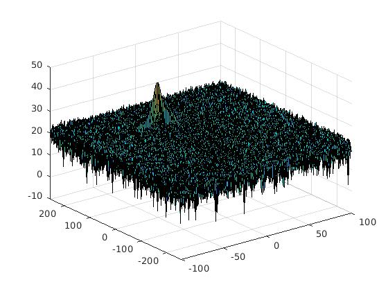
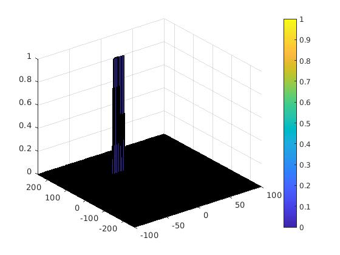

# SFND-Target-Generation-Detection
Radar target generation and detection project of Udacity Sensor Fusion Nanodegree program program using matlab. Includes designing an FMCW Radar, applying 2D FFT, and CA-CFAR.

# Implementation details

## CA-CFAR
The 2D CA-CFAR(Cell Averaging-Constant False Alarm Rate) is implemented by iterating over all the eligible CUT (Current-cell Under Test) cells while summing training cells, guard cells, and CUT. The resulting sum is then subtracted with the sum of guard cells and CUT to obtain the noice solely present in training cells. 

The summation occurs after converting logarithmic scale to linear i.e. dB(decibel) to W(Watt). The mean of the final noice is computed and added with a predifined offset to arrive at the effective threshold for the CUT.

## Hyper-parameters
The offset, the number of training and guard cells along the range and doppler dimension are selected by a trial and error method.

## Surpressing non-thresholded cells
Since the non-thresholded cells lie at the boundaries of the RDM(Range Doppler Map) and are pre-determined, these cells are treated as 4 blocks of cells (with overlap) and are set to manually zero by using double indexing and suitable index ranges.

# Results
## 1D-FFT of the generated traget at 110 meters from the ego vehicle

## Unfiltered 2D-FFT plot with magnitude along z-axis

## CA-CFAR output of the 2D-FFT

